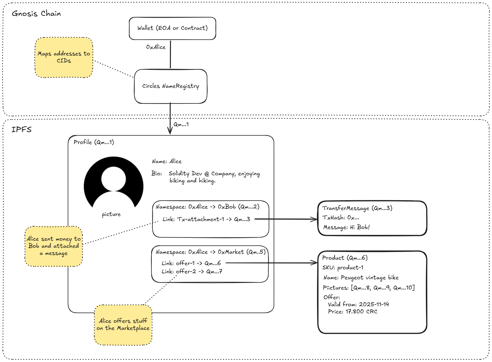

# Circles Profiles

Circles is a decentralized, community-driven currency grounded in personal trust. You issue your own money, form trust
networks, and create resilient economic communities—without relying on any central authority.

**Circles Profiles** pushes this idea further. **It gives every Address on Gnosis Chain —whether a person, a group, or a
dApp—its own portable space** to store and share off-chain data. Everything stays in namespaces you control, not in
someone else’s backend.

---

## Your Data Should Stay Yours

Most Ethereum-based apps (besides their Smart Contracts) live in their own cloud silos. Each one demands a fresh
profile, fresh preferences, fresh everything. Your data ends up scattered behind closed APIs that don’t talk to each
other and definitely don’t belong to you.

Circles Profiles changes the dynamic. Instead of adapting to every new app, you keep your own data in a personal space
secured by cryptographic signatures and open standards. Everything you publish lives on IPFS — following a pattern
already proven in earlier decentralized systems that separate signed metadata from blob storage. Nothing gets locked
away in places you can’t access.

---

## Profiles For All 🥳

Profiles work seamlessly across all account types in the Circles ecosystem:

* **Humans**
  You issue your own CRC and manage your own profile. Good to store app preferences, encrypted private notes, or
  marketplace listings.

* **Organizations**
  Shops, projects, or dApps that want an easy way to publish offers and information for their users.

* **Groups**
  Collective accounts issuing a shared group currency. Ideal for local networks, marketplaces, loyalty programs, or
  member-based communities.

All of them gain the same open, user-controlled approach to storing and sharing off-chain data — **and you can even use
Circles Profiles without a Circles account at all by simply registering your profile at the NameRegistry contract.**

---

## What You Gain With Circles Profiles

### 🚀 One Set of Preferences, Everywhere

Set your preferences once and reuse them across wallets or dApps. If the data is sensitive, encrypt it first — Profiles
don’t include built-in encryption and rely on whatever you or your apps provide.

### 🛍️ Marketplaces Without Gatekeepers

Profiles make it easy to build marketplaces that stay open and user-centric:

* Anyone can publish offers directly from their namespace.
* You choose whose offers you pay attention to — trusted individuals, specific groups, curated lists, or combinations
  of them.
* Aggregators can read public data and surface helpful results without owning or controlling the listings.

Users own the data; marketplaces compete by being useful rather than by locking anyone in.

### 🌱 Reputation Signals

Communities and dApps can write small attestations into your namespace — for example that you've completed a task,
contributed to a project, or fulfilled a marketplace deal. These signals stay portable and can be reused by other apps
without building isolated reputation systems.

---

## Under the Hood: How Circles Profiles Work

Profiles build on the same trust-based foundation as the Circles currency system. Each address gets a structured way to
publish off-chain data that is both verifiable and portable.

Some of the design may feel familiar to anyone who has worked with earlier decentralized systems. The pattern of
giving each identity its own signed, append-only log — something Scuttlebutt pioneered — maps cleanly to our namespaces,
where signed links reference content stored on IPFS. JSON-LD helps keep things flexible and meaningful.

Here’s the core setup:

* **Profile Document**
  A JSON-LD file stored on IPFS holding your metadata, keys, and pointers to namespaces.

* **Namespaces**
  Append-only logs of signed “links.” This resembles the SSB approach: signatures protect the structure, while the
  actual content is stored elsewhere. The important difference is that your namespace reflects only what you choose to
  keep — you can remove links at any time, so your profile stays curated rather than becoming a permanent history.
  **The chain already handles immutability where it actually matters; the profile layer doesn’t need to duplicate that.**

* **Mirroring**
  A way to bring in signed links from other namespaces and store them inside your own. It works like a selective
  follow-style replication: you only keep the entries that matter to you.

### Reading Data: Pulling From People You Trust

Circles Profiles follow a pull-based model. There’s no central index that every app queries.
Instead, you choose *whose* namespaces you want to read from.

The Circles trust graph naturally helps here:

* Wallets and apps can simply **pull data from the people you trust**, showing only their offers, signals, or messages.
  This can be done entirely client-side — trust relationships already exist on-chain.

* For broader discovery, **aggregation providers** can watch many namespaces at once, crunch the data, and expose
  filtered results (e.g. “all offers in my region” or “all group signals”).
  Since all entries remain signed, you never lose visibility into **who actually published what**.

No matter whether you're pulling directly from individual addresses or consuming curated results from an aggregator,
the provenance stays intact.

Apps don’t need custom APIs or trust each other’s backends. They simply read the signed, user-owned data directly from
the network.

### Displaying Data

Frontends don’t have to guess how to render anything.
Because payloads use **JSON-LD types**, apps can detect what kind of object they’re looking at — an offer, a preference,
a badge, or something completely custom — and display it appropriately.

---

## Why This Matters for the Circles Ecosystem

Circles Profiles extends the original vision—an economy that’s fair, resilient, and user-owned—beyond currency:

* **More resilience**
  Decentralized storage avoids lock-in and single points of failure.

* **Less backend repetition for developers**
  A single open format replaces a patchwork of private APIs.

* **Genuine interoperability**
  Apps can interact through user-owned data instead of closed server-to-server integrations.

* **Infrastructure sustainability**
  Infrastructure providers (e.g. IPFS pinning services) can take a fee in Circles to cover their operating costs.

**Why sustainability matters:**
Past decentralized or federated systems often drifted back into the hands of a few large operators because small,
independent hosts couldn’t sustain the cost or time required to keep services running. With Circles-based fees,
operators can actually cover these costs. And since everyone can mint Circles, through their trust network, access to
basic infrastructure remains possible even when fees exist.
Because data stays portable, users can switch providers easily — encouraging a healthy market for hosting and pinning
instead of accidental re-centralization.

---

## Getting Started

You don’t need to grasp the full system right away. A few small steps are enough to get going:

* Create a profile for your personal, organizational, or group address.
* Publish something simple — a message, marketplace offer or a preference object.
* Build a tiny reader that fetches and displays it.

From there, everything scales naturally. Over time, your Circles Address becomes more than a keypair—it becomes your
portable digital home.
