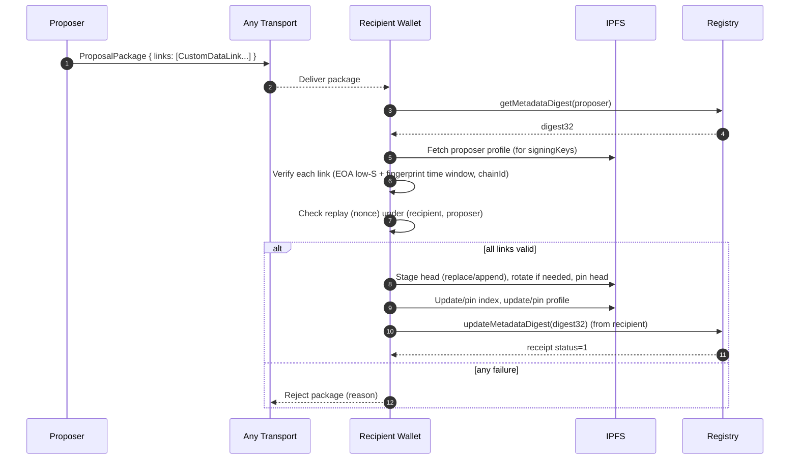
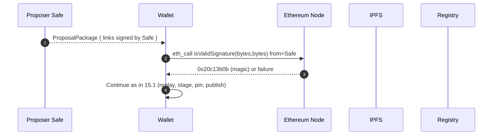

# Circles Profiles — Proposer Pattern

## 0. Scope & high-level

This document specifies the **Proposer Pattern** for Circles Profiles: an operator (EOA or contract wallet such as a Safe) **proposes** a signed **link** to a recipient avatar, and the recipient’s wallet **accepts** the proposal by inserting the link unchanged into the recipient’s namespace and publishing an updated profile.

The pattern is **application-agnostic**. The proposed link may point to any payload on IPFS (e.g., settings, messages, receipts, attestations, keys). Storage remains IPFS; authenticity is cryptographic (EOA ECDSA or ERC-1271). This spec defines:

* The **proposal package** shape (off-chain transport).
* **Verification** of the proposed link against the operator’s published keys.
* **Acceptance** (write & publish) semantics.
* **Replay** and **ordering** rules.
* **Error**, **security**, and **interoperability** guidance.

This document builds on the base Circles Profiles spec. Where repeated, constraints are **normative** here.

---

## 1. Actors & components

* **Proposer** — an operator identity (EOA or Safe) that constructs and signs a **link**.
* **Recipient avatar** — Ethereum address (EOA or contract) that owns the profile receiving the link.
* **Wallet (recipient client)** — software acting on behalf of the recipient to verify proposals and publish updates.
* **Registry** — on-chain name registry mapping `avatar → bytes32 digest` (current profile digest32).
* **IPFS** — content store (add/cat) for payloads, chunks, indices, and profiles.
* **Observer** — any reader (app/device) that fetches and verifies the recipient’s namespace after acceptance.

---

## 2. Identifiers, encodings & limits (normative)

Unless stated otherwise, the base protocol’s identifiers apply.

### 2.1 Ethereum address

* **Binary:** 20 bytes.
* **String form:** lowercase hex with `0x` prefix, `^0x[a-f0-9]{40}$`.
* Writers MUST emit lowercase in all JSON fields governed by this spec. Input comparison is case-insensitive.

### 2.2 CIDs

* **CIDv0 only** for profile, index, and chunk objects; base58btc, 46 chars, starts with `Qm`.
* Payload CIDs SHOULD be CIDv0 to align acceptance rules.

### 2.3 Hex & sizes

* Hex strings are `0x`-prefixed, lowercase.
* **Nonce:** 16 random bytes → 32 hex chars after `0x`.
* **Signature:** 65 bytes (`r(32)||s(32)||v(1)`) → 130 hex chars after `0x`.
* **Size cap:** Any IPFS object that readers must fetch (profile/index/chunk/payload) MUST be ≤ **8,388,608 bytes** (8 MiB).

### 2.4 Time

* Unix seconds (UTC), 64-bit signed integer range.
* Wallets MUST tolerate small future skew for `signedAt` (e.g., ≤ 30 s).

---

## 3. Namespaces & write target (normative)

A **namespace** is identified by `(ownerAvatar, namespaceKey)`.

* **Namespace key rule:** `namespaceKey` MUST be an Ethereum address string (lowercase).
* **Proposer pattern convention:** proposals are intended for the recipient’s namespace keyed by the **proposer address** (EOA or Safe), i.e., `(recipient, proposer)`.

Writers MUST NOT produce non-address keys. Readers MUST ignore non-address keys.

---

## 4. Proposal objects (wire/transport)

A **proposal** is an off-chain package that carries one or more **pre-signed links** from a proposer to a recipient.

### 4.1 CustomDataLink (normative, signed envelope)

Unchanged from the base spec; included here for completeness:

```json
{
  "name": "logical-name",
  "cid": "Qm<payloadCidV0>",
  "encrypted": false,
  "encryptionAlgorithm": null,
  "encryptionKeyFingerprint": null,
  "chainId": 100,
  "signerAddress": "0xproposeraddrlowercase0000000000000000",
  "signedAt": 1724310000,
  "nonce": "0x0123456789abcdeffedcba9876543210",
  "signature": "0x<130-hex r||s||v>"
}
```

**Replay fields are mandatory:** `chainId`, `signerAddress`, `signedAt`, `nonce`.

### 4.2 ProposalPackage (transport wrapper, normative)

The wrapper carries one or more links and optional acceptance constraints. It is NEVER stored on-chain by this pattern.

```json
{
  "schemaVersion": "1.0",
  "links": [ CustomDataLink, ... ],
  "intendedNamespaceKey": "0x<proposer-address-lowercase>",
  "expiresAt": 0,
  "audience": [], 
  "constraints": {
    "requireIntendedKeyMatch": true,
    "maxSignedAtSkewSecs": 120
  },
  "hints": {
    "summary": "Human-readable purpose",
    "payloadTypes": { "logical-name": "type-hint" }
  }
}
```

**Constraints (normative):**

* `links.length ≥ 1`.
* `intendedNamespaceKey` MUST be a valid address string (lowercase).
  If `constraints.requireIntendedKeyMatch` is true (default true), wallets MUST enforce
  `link.signerAddress == intendedNamespaceKey` for all links.
* If `expiresAt > 0`, wallets MUST reject the package if `now ≥ expiresAt`.
* If `audience` is non-empty, wallets MUST reject unless the recipient’s avatar address is present (lowercase exact match).
* Unknown fields MUST be ignored by wallets.

---

## 5. Canonicalisation (normative)

Before hashing/signing/verifying a **link**, compute canonical JSON bytes with the `signature` property removed.

Rules:

1. **Objects:** sort properties by Unicode code-point name; reject duplicates; omit `signature`.
2. **Arrays:** preserve order.
3. **Booleans/null:** emit literal tokens.
4. **Strings:** emit JSON strings.
5. **Numbers:** write as 64-bit integer literal if it fits; otherwise as shortest-round-trip IEEE-754 double; else reject.

**Payload hash:** `keccak256(canonical-bytes)`.

---

## 6. Signing & verification (normative)

### 6.1 EOA

* **Message:** `keccak256(canonical-bytes)`.
* **Low-S required** (EIP-2).
* On-wire `v ∈ {27, 28}`.
* **Verify:** Recover address and compare to `signerAddress`.

### 6.2 Safe (ERC-1271, bytes path)

Compute Safe hashes as in the base spec; verify via:

* Call `isValidSignature(bytes data, bytes signature)` on `signerAddress` with:

  * `data = canonical-bytes`
  * **`eth_call.from = signerAddress`**
* Success if first 4 return bytes equal `0x20c13b0b`.
* MAY retry once with `v` toggled `{27,28} ↔ {31,32}` if the first call returned non-magic without revert.
* Optionally try the `bytes32` overload; success if return equals `0x1626ba7e`.

**EOA fallback:** If `signerAddress` has no code, treat as EOA.

---

## 7. Trust roots (operator key publication, normative)

Wallets MUST establish the proposer’s signing keys as follows.

### 7.1 EOA proposer

1. Resolve the proposer’s **profile** via the Registry (`getMetadataDigest(proposer)`), fetch via IPFS.
2. From profile, read `signingKeys` map:

   * **Fingerprint** is `keccak256(uncompressed 64-byte pubkey)` (65-byte uncompressed key without `0x04`).
3. On link verification:

   * Recover the pubkey; compute fingerprint; look up in `signingKeys`.
   * Enforce **time bounds**: `validFrom ≤ signedAt`, and if present `signedAt < validTo` and `signedAt < revokedAt`.

### 7.2 Safe proposer

* Verify via ERC-1271 `bytes` path (above). No fingerprint check required.
* The Safe itself is the key boundary.

**Failure to fetch profile or keys** MUST be treated as an error (see §13).

---

## 8. Wallet acceptance (normative)

Given a `ProposalPackage` and recipient `ownerAvatar`:

1. **Pre-checks (package):**

   * Validate JSON shapes per §4.2; enforce `expiresAt` and `audience` if present.
   * Compute `intendedNamespaceKeyLower = intendedNamespaceKey`.
   * For every link: require `link.signerAddress == intendedNamespaceKeyLower` if `requireIntendedKeyMatch` (default).

2. **Link verification:**

   * For each link, compute canonical bytes (omit `signature`), then:

     * **Check `chainId`** equals the verifying chain.
     * **EOA path:** verify low-S signature and fingerprint membership/time window per §7.1.
     * **Safe path:** ERC-1271 verification per §6.2.
     * Reject any link that fails; if any link fails, acceptance MUST NOT commit any changes (atomic bundle rule).

3. **Replay protection (tuple scope):**

   * For each link, compute tuple `T = (ownerAvatar, intendedNamespaceKeyLower, link.signerAddress)`.
   * Query existing entries under `(ownerAvatar, intendedNamespaceKeyLower)` (index + head + older chunks as needed) to detect **duplicate `nonce`** within T.
   * If a duplicate `nonce` is found, reject that link; if any link is rejected, abort the bundle (no partial acceptance).

4. **Write staging (batch):**

   * Prepare the **head chunk** for `(ownerAvatar, intendedNamespaceKeyLower)` using the writer algorithm:

     * If `head.links.length == 100`, rotate per §10.
     * For any `link.name` already present in the head, **replace**; else **append**.
   * Wallets SHOULD batch all accepted links in a single head commit (one index update and one profile publish).

5. **Commit & publish (pin required):**

   * Pin the staged head; on failure, abort.
   * Update index entries for all links in the head; set `index.head`; pin index; on failure, abort and do not mutate profile.
   * Update `profile.namespaces[intendedNamespaceKeyLower] = indexCid`; serialize profile; pin; on failure, abort.
   * Call `updateMetadataDigest(digest32)` from `ownerAvatar` (EOA tx or Safe `execTransaction`).
   * Require receipt `status == 1`.

**Atomicity:** Acceptance is **all-or-nothing** at the package level. Wallets MUST ensure no partial writes occur if any link fails verification or pinning.

---

## 9. Reading after acceptance (normative)

Observers read `(ownerAvatar, intendedNamespaceKeyLower)`:

1. Resolve the owner’s profile via the Registry; fetch index and head.
2. **Ordering:** newest-first by `signedAt` descending; tie-break by higher array index within its chunk.
3. **Verification:** re-verify links cryptographically on read; drop invalid links.
4. **Replay scope:** enforce duplicate-nonce per tuple `(owner, namespaceKey, signerAddress)`.

---

## 10. Writer rotation (normative)

* Maximum links per chunk: **100**.
  On insert beyond 100:

  1. Pin current head → `closedCid`.
  2. For each link in the closed head, set `index.entries[link.name] = closedCid`.
  3. Start a new head `{ "prev": closedCid, "links": [] }`.

---

## 11. Mirroring (optional but recommended)

The Proposer Pattern is equivalent to inserting a **byte-for-byte identical** `CustomDataLink` signed by the proposer into the recipient’s namespace `(recipient, proposer)`.

* Writers MUST NOT modify any field in the link when inserting (mirror rule).
* Wallets MUST pin the `cid` referenced by the link and MUST fail acceptance if pinning cannot be confirmed.
* Mirrorers SHOULD pin the updated head/index/profile as part of publishing.

---

## 12. Security & privacy (required behavior & guidance)

* **Low-S** enforcement for EOA signatures; high-S is rejected.
* **Chain domain:** `chainId` MUST match the verifying chain.
* **Clock skew:** tolerate ≤ 30 s future skew for `signedAt`; wallets MAY enforce additional local staleness policy (non-normative).
* **Encryption:** If `link.encrypted == true`, payload format and key distribution are application-defined. Wallets SHOULD record `encryptionAlgorithm` and `encryptionKeyFingerprint` if present and MUST NOT attempt decryption without local key material.
* **Availability/pinning:** Wallets MUST pin payload CIDs and MUST fail acceptance on pin failure. Multiple pin targets are RECOMMENDED.
* **Payload neutrality:** Acceptance MUST NOT depend on parsing the payload; only link-level cryptography and constraints are normative here.

---

## 13. Error handling (normative)

* **Invalid link signature** → reject link; reject entire package (atomic rule).
* **Replay (duplicate nonce in tuple scope)** → reject link; reject package.
* **Key validation failure** (EOA fingerprint absent or out of window; ERC-1271 non-magic) → reject package.
* **Transport/RPC errors** (registry/IPFS/Safe call) → **throw**; do not map to “invalid”.
* **Pinning failure** (head/index/profile/payload) → **throw**; profile MUST NOT be mutated.
* **CID policy violation** (CIDv1 for profile/index/chunk) → **reject/throw**.
* **Malformed JSON** (proposal, link, profile, index, chunk) → **throw** with offending object identifier (CID or context).

---

## 14. Examples

### 14.1 Single-link EOA proposal package

```json
{
  "schemaVersion": "1.0",
  "intendedNamespaceKey": "0x5abfec25f74cd88437631a7731906932776356f9",
  "expiresAt": 1729999999,
  "links": [
    {
      "name": "prefs-v1",
      "cid": "QmWmyoMoctfbA...",
      "encrypted": false,
      "encryptionAlgorithm": null,
      "encryptionKeyFingerprint": null,
      "chainId": 100,
      "signerAddress": "0x5abfec25f74cd88437631a7731906932776356f9",
      "signedAt": 1724310000,
      "nonce": "0x12ab34cd56ef78aa12ab34cd56ef78aa",
      "signature": "0x<130-hex>"
    }
  ]
}
```

### 14.2 Multi-link bundle (atomic)

```json
{
  "schemaVersion": "1.0",
  "intendedNamespaceKey": "0xoperator00000000000000000000000000000000",
  "links": [
    { "name": "policy-v1", "cid": "QmA...", "encrypted": false, "chainId": 100, "signerAddress": "0xoperator...", "signedAt": 1724310100, "nonce": "0x...", "signature": "0x..." },
    { "name": "prefs-v2",  "cid": "QmB...", "encrypted": true,  "encryptionAlgorithm": "x25519+chacha20poly1305+v1", "encryptionKeyFingerprint": "0x<64-hex>", "chainId": 100, "signerAddress": "0xoperator...", "signedAt": 1724310120, "nonce": "0x...", "signature": "0x..." }
  ]
}
```

---

## 15. Sequence diagrams

### 15.1 EOA proposer → wallet accept (verified, batch)



### 15.2 Safe proposer → wallet accept (ERC-1271 bytes path)



---

## 16. Conformance checklist

1. Addresses match `^0x[a-f0-9]{40}$`; writers emit lowercase.
2. `ProposalPackage` shape per §4.2; unknown fields ignored.
3. Canonical JSON bytes for link hashing match §5; test vectors round-trip.
4. EOA signatures are low-S; fingerprints present and time-bounded.
5. Safe signatures validate via ERC-1271 `bytes` with `from = signerAddress`; allow one V-toggle retry.
6. Writer batches accepted links; rotates at 100; index/head semantics per §10.
7. Replay scope is `(owner, namespaceKey, signerAddress)`; duplicate nonce rejected.
8. All required pins succeed before profile publish; failures abort changes.
9. Readers verify links, order newest→oldest by `signedAt` with tie-break by array index.

---

## 17. Interop notes

* **CID policy:** profile/index/chunk MUST be CIDv0. Payloads SHOULD be CIDv0.
* **Chain domain:** do not hard-code `chainId`; stamp from the current verifying chain.
* **Safe verification:** always set `eth_call.from = <safe>`; one V-toggle retry allowed.
* **Numeric canonicalisation:** only `int64` or shortest-round-trip double; otherwise reject on signing/verification.

---

## 18. Optional extensions (non-normative)

* **Attested mirror:** recipients may post an additional `mirror.v1` payload (audit trail of what was seen, where, when).
* **Local staleness policy:** wallets may reject proposals older than a configurable age even if signatures verify.
* **UI hints:** `hints.summary` and `hints.payloadTypes[link.name]` can be displayed; MUST NOT affect acceptance decisions.
* **Selective accept:** wallets MAY allow accepting a subset of links from a bundle; if chosen, the subset MUST still be committed atomically (one publish).

---

## 19. ABIs (normative references)

**Registry (subset):**

```json
[
  { "type":"function","name":"updateMetadataDigest","inputs":[{"type":"bytes32","name":"_metadataDigest"}],"outputs":[],"stateMutability":"nonpayable" },
  { "type":"function","name":"getMetadataDigest","inputs":[{"type":"address","name":"_avatar"}],"outputs":[{"type":"bytes32"}],"stateMutability":"view" }
]
```

**ERC-1271:**

```json
[
  { "type":"function","name":"isValidSignature","stateMutability":"view","inputs":[{"name":"_hash","type":"bytes32"},{"name":"_signature","type":"bytes"}],"outputs":[{"name":"magicValue","type":"bytes4"}] },
  { "type":"function","name":"isValidSignature","stateMutability":"view","inputs":[{"name":"_data","type":"bytes"},{"name":"_signature","type":"bytes"}],"outputs":[{"name":"magicValue","type":"bytes4"}] }
]
```

**ERC-1271 magic values:** bytes32: `0x1626ba7e`; bytes: `0x20c13b0b`.

---

## 20. Implementation notes

* Enforce the 8 MiB cap both via headers and streaming hard cap during IPFS fetches.
* Pin to multiple targets (local node + remote service) for durability.
* Cache resolved profiles/indices using CID Etags; invalidate on registry digest changes.
* Never rely on payload semantics for acceptance; rely only on link cryptography and proposal constraints.

